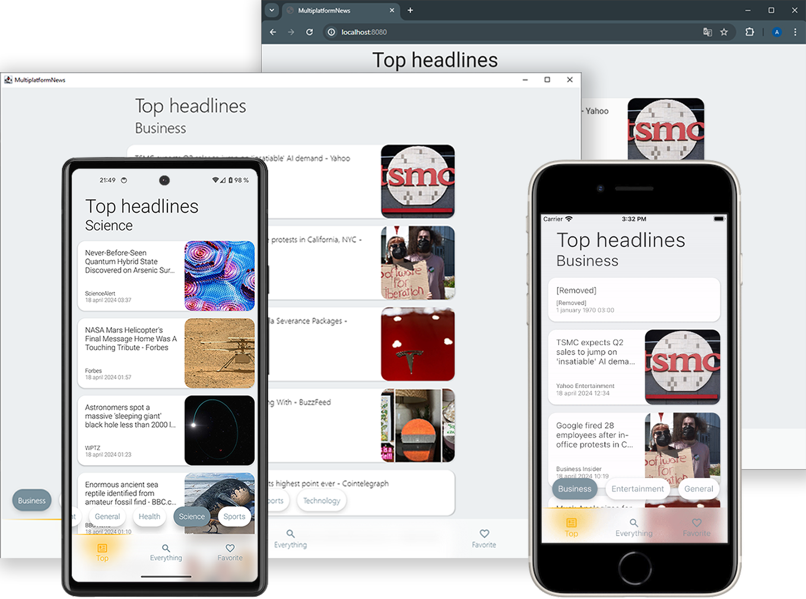

# Multiplatform News

\

Sample KMP and Compose Multiplatform application showing news using [NewsAPI](https://newsapi.org/)\
Generated using [Compose Multiplatform Wizard](https://terrakok.github.io/Compose-Multiplatform-Wizard/)\

\

Stack:
* [Compose Multiplatform](https://github.com/JetBrains/compose-multiplatform)
* [Decompose](https://github.com/arkivanov/Decompose)
* [Ktor](https://github.com/ktorio/ktor)
* [Sqldelight](https://github.com/cashapp/sqldelight)
* [Koin](https://github.com/InsertKoinIO/koin)
* [Kotlin Coroutines](https://github.com/Kotlin/kotlinx.coroutines)
* [Kermit](https://github.com/touchlab/Kermit)
* [BuildConfig](https://github.com/gmazzo/gradle-buildconfig-plugin)
* [Kotlin Serialization](https://github.com/Kotlin/kotlinx.serialization)
* [Kotlin DateTime](https://github.com/Kotlin/kotlinx-datetime)
* [Multiplatform Settings](https://github.com/russhwolf/multiplatform-settings)
* [Coil](https://github.com/coil-kt/coil)
* [Multiplatform Paging](https://github.com/cashapp/multiplatform-paging)

\

## Before running!
- check your system with [KDoctor](https://github.com/Kotlin/kdoctor)
- install JDK 17 on your machine
- add `local.properties` file to the project root and set a path to Android SDK there
- add `NEWS_API_KEY = {secret key}` with a secret key for [NewsAPI](https://newsapi.org/account) to `local.properties` file

### Android
To run the application on android device/emulator:
- open project in Android Studio and run imported android run configuration

To build the application bundle:
- run `./gradlew :composeApp:assembleDebug`
- find `.apk` file in `composeApp/build/outputs/apk/debug/composeApp-debug.apk`

### Desktop
Run the desktop application: `./gradlew :composeApp:run`

### iOS
To run the application on iPhone device/simulator:
- Open `iosApp/iosApp.xcproject` in Xcode and run standard configuration
- Or use [Kotlin Multiplatform Mobile plugin](https://plugins.jetbrains.com/plugin/14936-kotlin-multiplatform-mobile) for Android Studio

### Browser
Run the browser application: `./gradlew :composeApp:jsBrowserDevelopmentRun`\
If you need to update Yarn: `./gradlew :kotlinUpgradeYarnLock`

